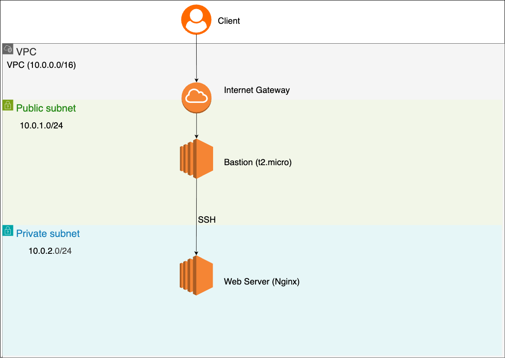

# AWS + Terraform ネットワーク自動構築ハンズオン

手動で構築したAWSのネットワーク環境（VPC、サブネット、NATゲートウェイ、EC2）を、Terraformを用いて完全自動化（IaC化）した学習記録です。

## 🎉 構築の成果（Nginx起動成功！）
踏み台サーバーを経由してプライベートサブネット内のWebサーバーへアクセスし、Nginxの自動構築と稼働に成功しました！


---

## 📝 構成図


### アーキテクチャのポイント
* **セキュアなネットワーク分離:** パブリックサブネットに踏み台サーバーを配置し、Webサーバーはインターネットから直接アクセスできないプライベートサブネットに隔離して、セキュリティを確保
* **NATゲートウェイの活用:** プライベートサブネット内のWebサーバーが、安全に外部インターネットからパッケージをダウンロードできるようルーティングを構成
## セキュリティについて
踏み台サーバーのSSHインバウンドは学習目的のため `0.0.0.0/0` で設定しています。
実務では自IPのみ許可（`var.my_ip` で変数化）する構成が正しいです。

## 🛠️ 使用技術
* **クラウドプロバイダー:** AWS 
* **IaCツール:** Terraform
* **主要リソース:**
  * VPC (10.0.0.0/16)
  * パブリックサブネット (10.0.1.0/24) / プライベートサブネット (10.0.2.0/24)
  * インターネットゲートウェイ / NATゲートウェイ
  * パブリックルートテーブル / プライベートルートテーブル
  * セキュリティグループ (踏み台用 / Webサーバー用)
  * EC2 (Amazon Linux 2023 / t3.micro) × 2台

## 🚀 実行手順
このリポジトリのコードを使って環境を構築・確認・削除する手順です。


```bash
#初期化
terraform init
# 計画の確認
terraform plan
# 構築
terraform apply

# 現場確認
terraform show

# 削除
terraform destroy