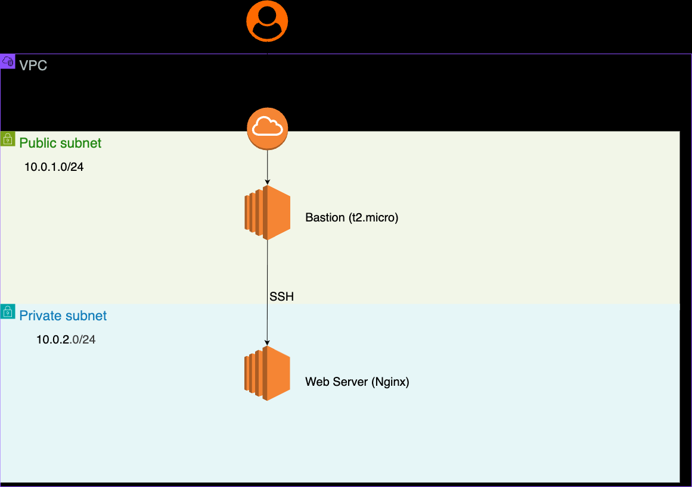
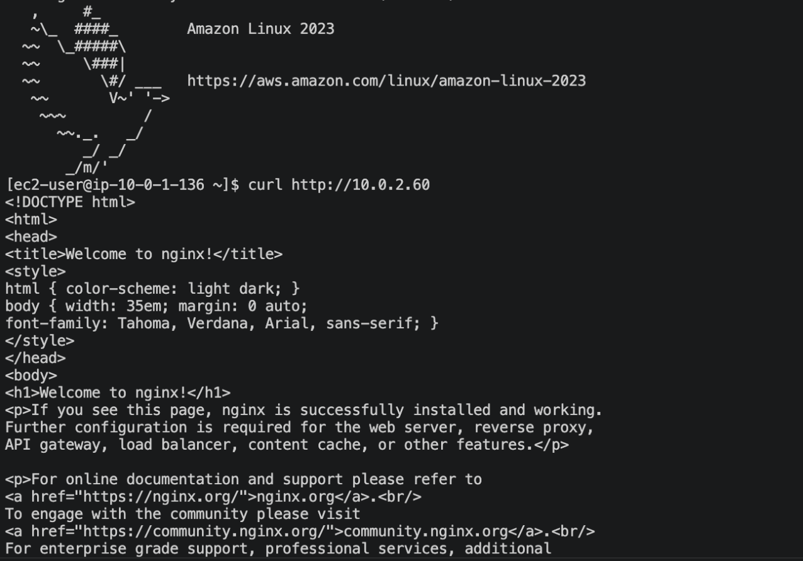

# AWS + Terraform ネットワーク自動構築ハンズオン

手動で構築したAWSのネットワーク環境（VPC、サブネット、NATゲートウェイ、EC2）を、Terraformを用いて完全自動化（IaC化）した学習記録です。

## 📝 構成図

*(※ここに構成図の画像を載せます)*

## 🛠️ 使用技術
* **インフラプロバイダー:** AWS (Amazon Web Services)
* **IaCツール:** Terraform
* **構築リソース:**
  * VPC (10.0.0.0/16)
  * パブリックサブネット / プライベートサブネット
  * インターネットゲートウェイ / NATゲートウェイ
  * ルートテーブル
  * セキュリティグループ
  * EC2 (Amazon Linux 2023) × 2台

## 🚀 実行手順
このリポジトリのコードを使って環境を構築・削除する手順です。

1. **初期化と確認**
   ```bash
   terraform init
   terraform plan

   